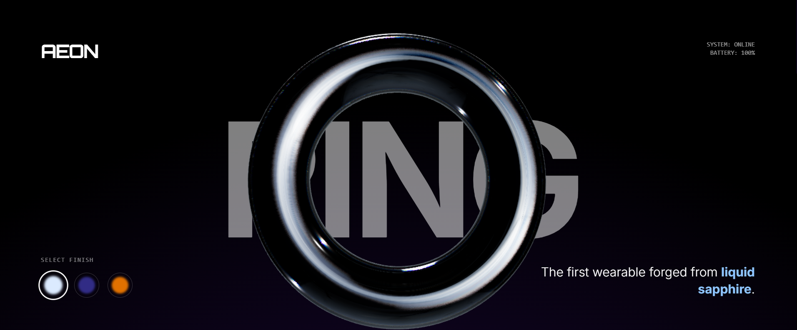

# AEON ✦ The Ring of Tomorrow

> **"The first wearable forged from liquid sapphire."**


*(Save your screenshot as 'preview.png' in the public folder or root!)*

## ✧ Concept
**AEON** is a concept landing page for a futuristic smart wearable. Crafted from a proprietary glass-ceramic composite, the ring feels weightless while offering advanced biometric tracking. The site uses 3D rendering to showcase the liquid sapphire finish in real-time.

## 🛠 Tech Stack
* **Framework:** Next.js (React)
* **3D Engine:** React Three Fiber (R3F) & Drei
* **Styling:** Tailwind CSS
* **Animation:** GSAP / Framer Motion

## 💎 Features
* **Interactive 3D Model:** Real-time rendering of the ring with material nuances.
* **Liquid Physics:** Custom shaders simulating the "liquid sapphire" texture.
* **Modern UI:** Minimalist interface with high-contrast typography.

## 🚀 Getting Started

1.  Clone the repository:
    ```bash
    git clone [https://github.com/your-username/aeon-ring.git](https://github.com/your-username/aeon-ring.git)
    ```
2.  Install dependencies:
    ```bash
    npm install
    ```
3.  Run the development server:
    ```bash
    npm run dev
    ```

---
*Forged by [Your Name]*